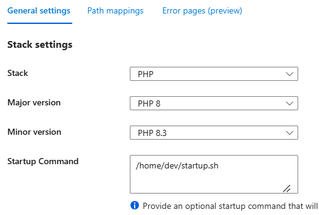

# Configure Azure Linux Web App to Allow Larger File Uploads for PHP Applications

This README provides instructions to configure a PHP application running in an Azure Linux Web App to support larger file uploads. The setup includes customizing Nginx and PHP configurations.


## Prerequisites

1. A PHP application deployed to an **Azure Linux Web App** running on php8.3.
2. Access to the **Azure Portal** and **Kudu/SSH** for the Web App.


## Steps to Configure

### Step 1: Backup and Modify the Nginx Configuration

1. **Access the Web App via SSH:**
   - In the Azure Portal, navigate to your Web App.
   - Select **SSH** from the Development Tools.

2. **Create the `dev` Folder (if not already created):**
   - In SSH, create a directory named `dev` under `/home` if it doesn’t already exist:

3. **Backup the Default Nginx Configuration:**
   ```bash
   cp /etc/nginx/sites-enabled/default /home/dev
   ```

4. **Modify the `default` Configuration File:**
   - Navigate to `/home/dev`:
     ```bash
     cd /home/dev
     ```
   - Edit the `default` file and add the following inside the `server` block:
     ```nginx
     # Allow larger upload sizes
     client_max_body_size 50M;
     ```

---

### Step 2: Create a Custom Startup Script

1. **Create the `startup.sh` File:**
   - Navigate to `/home/dev` and create a file named `startup.sh`:
     ```bash
     nano /home/dev/startup.sh
     ```
   - Add the following script:
     ```bash
     #!/bin/bash
     echo "Copying custom default.conf over to /etc/nginx/sites-enabled/default"

     # Copy the custom Nginx configuration
     cp /home/dev/default /etc/nginx/sites-enabled/default

     # Reload Nginx to apply the changes
     nginx -s reload
     ```
   - Save the file and exit.


2. **Set the Script as the Startup Command:**
   - In the Azure Portal, go to your Web App.
   - Navigate to **Configuration** > **General Settings** > **Startup Command**.
   - Set the startup command to:
     ```bash
     /home/dev/startup.sh
     ```
   - Save the changes.
   - 
---

### Step 3: Modify PHP Configuration

1. **Create a Custom `ini` File:**
   - Navigate to `/home/site/wwwroot`:
     ```bash
     cd /home/site/wwwroot
     ```
   - Create a folder named `ini`:
     ```bash
     mkdir ini
     ```
   - Inside the `ini` folder, create `extensions.ini`:
     ```bash
     nano ini/extensions.ini
     ```
   - Add the following content:
     ```ini
     upload_max_filesize=50M
     ```

2. **Add the Environment Variable:**
   - In the Azure Portal, go to **Configuration** > **Application Settings**.
   - Add a new setting:
     - Name: `PHP_INI_SCAN_DIR`
     - Value: `/home/site/wwwroot/ini`
   - Save the changes.

---

### Step 4: Restart the Web App

1. Restart the Web App via the Azure Portal:
   - Navigate to your Web App.
   - Select **Restart**.

---

## Verification

1. **Test File Upload:**
   - Deploy a sample PHP application with a file upload form.
   - Test uploading a file larger than 2MB (e.g., 50MB).

2. **Verify PHP Settings:**
   - Add a `phpinfo()` script to your app and verify `upload_max_filesize` is updated.


---

By following this guide, your PHP application will support larger file uploads while maintaining best practices in configuration and debugging.